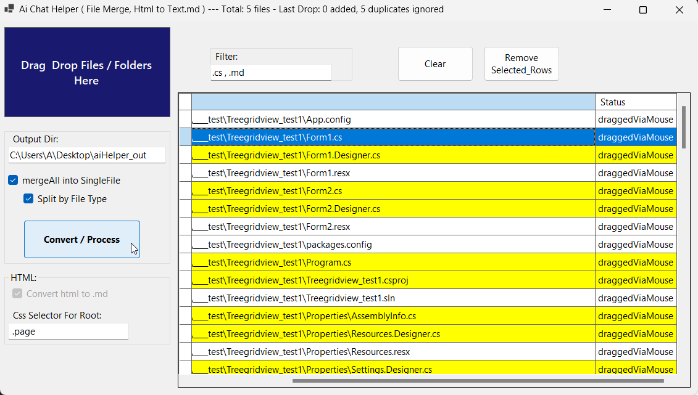

# ai_chat_helper_net8
 convert html to Markdown .  And Merge Them in to single file.

50% vibed with gemini 2.5 ...

#### WHY?  

* gemini doesn't take files that are in subfolder of "selected folder".
* i needed it to restructure my code files into better hierarcy.
  * so you need to feed gemini with file paths.
* i was tired doing it repeated when chat crashes at "google AI studio".

